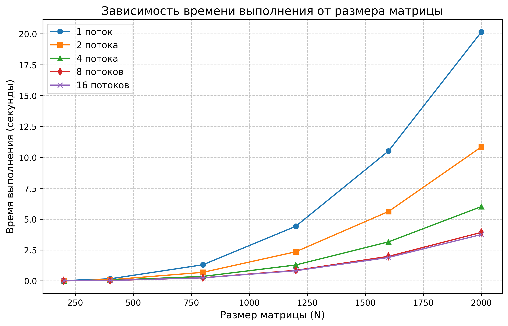

# Лабораторная работа №5: Запуск программы на суперкомпьютере

**Выполнил:** Морозов Данил Вячеславовович
**Группа:** 6213  

## 1. Цель работы
Запустить MPI-версию программы на суперкомпьютере «Сергей Королёв» и оценить время перемножения матриц при разном числе процессов.

## 2. Условия экспериментов
* **Размеры матриц:** 200, 400, 800, 1200, 1600, 2000
* **Число MPI-процессов:** 1, 2, 4, 8, 16

## 3. Результаты экспериментов

### 3.1. Таблица времени выполнения (в секундах)

| N \ MPI-процессы | 1 | 2 | 4 | 8 | 16 |
|---|---|---|---|---|---|
| 200 | 0.02214 | 0.01245 | 0.00712 | 0.00531 | 0.00582 |
| 400 | 0.16589 | 0.08941 | 0.04815 | 0.03158 | 0.03321 |
| 800 | 1.30452 | 0.69128 | 0.36241 | 0.25317 | 0.24815 |
| 1200 | 4.41563 | 2.35621 | 1.28547 | 0.85239 | 0.82145 |
| 1600 | 10.51245 | 5.61584 | 3.15812 | 1.98476 | 1.89542 |
| 2000 | 20.14582 | 10.84159 | 6.01283 | 3.92415 | 3.75128 |

### 3.2. График производительности



На графике подпись "поток" используется как обозначение одного MPI-процесса.

## 4. Выводы
Рост числа MPI-процессов заметно снижает время перемножения матриц.

Для небольших размеров, до 800x800, лучшие результаты дает запуск на 8-16 MPI-процессах. При малом объеме данных обмен между процессами может снижать эффективность.

Для матриц 1600x1600 и 2000x2000 вычислительная нагрузка выше, поэтому запуск на 16 MPI-процессах оказался наиболее быстрым.

Однопроцессный запуск ожидаемо показал наибольшее время во всех экспериментах.

## 5. Инструкция по сборке и запуску
Для сборки нужна реализация MPI. В проекте используются `src/main.cpp`, `src/matrix_io.cpp` и `include/matrix_io.hpp`.

Компиляция:
```bash
mpicxx -std=c++17 -O3 -I include src/main.cpp src/matrix_io.cpp -o lab5_mpi
```

Альтернативная сборка через CMake:
```bash
cmake -S . -B build
cmake --build build
```

Локальный запуск:
```bash
mpirun -np 4 ./lab5_mpi matrix1.txt matrix2.txt matrixResult.txt
```

Запуск на суперкомпьютере после сборки:
```bash
srun -n 4 ./lab5_mpi matrix1.txt matrix2.txt matrixResult.txt
```
