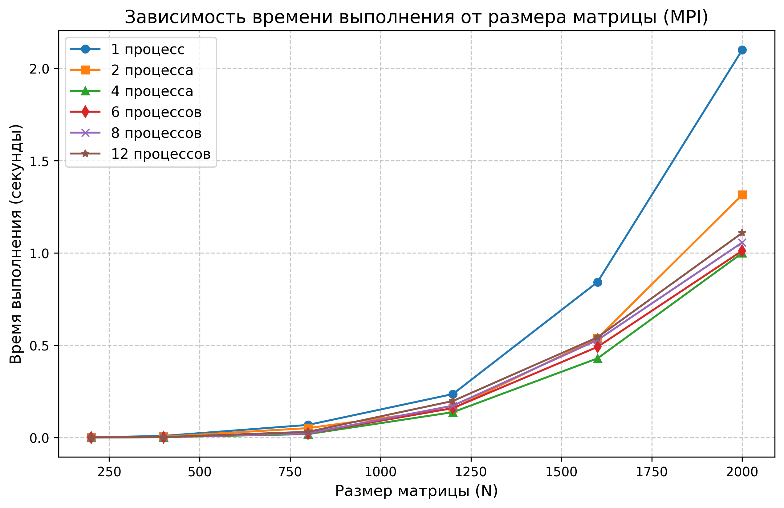

# Лабораторная работа №3: Параллельное перемножение матриц (MPI)

**Выполнил:** Морозов Данил Вячеславовович
**Группа:** 6213  

## 1. Цель работы
Разработать MPI-программу для перемножения квадратных матриц на архитектуре с разделенной памятью. Провести эксперименты, оценить ускорение и сравнить результаты с OpenMP-версией из ЛР №2.

## 2. Описание реализации
Программа написана на C++ с использованием `<mpi.h>`. Работа распределяется по схеме «Master-Worker»:
1. **Master-процесс (ранг 0)** считывает матрицы $A$ и $B$ из файлов.
2. Процесс 0 передает остальным процессам размер задачи $N$ через `MPI_Bcast`.
3. Матрица $B$ полностью рассылается всем процессам через `MPI_Bcast`, так как нужна при расчете каждой строки результата.
4. Матрица $A$ делится на группы строк. `MPI_Scatterv` распределяет их между процессами с учетом случая, когда $N$ не делится на число процессов.
5. Каждый процесс умножает свою часть строк $A$ на матрицу $B$; используется порядок циклов `i-k-j`.
6. `MPI_Gatherv` собирает локальные части результата в матрицу $C$ на процессе 0.

Время измеряется через `MPI_Wtime()`. Замер начинается после рассылки данных (`MPI_Bcast`, `MPI_Scatterv`) и заканчивается после локального умножения, поэтому в таблице приведено время вычислительной части.

## 3. Условия экспериментов
* **Оборудование:** Процессор (6 физических ядер, 12 потоков).
* **Параметры компилятора:** `mpicxx -std=c++17 -O3 -I include src/main.cpp src/matrix_io.cpp -o lab3_mpi`.
* **Исследуемые объемы задачи N:** 200, 400, 800, 1200, 1600, 2000.
* **Количество процессов:** 1, 2, 4, 6, 8, 12.
* **Верификация:** Автоматизированная проверка результатов через Python (NumPy) пройдена на 100%.

## 4. Результаты экспериментов

### 4.1. Таблица времени выполнения (в секундах)
| N \ Процессы | 1 | 2 | 4 | 6 | 8 | 12 |
|---|---|---|---|---|---|---|
| 200 | 0.00162 | 0.00074 | 0.00046 | 0.00087 | 0.00089 | 0.00161 |
| 400 | 0.00962 | 0.00533 | 0.00286 | 0.00302 | 0.00336 | 0.00276 |
| 800 | 0.06919 | 0.05193 | 0.01943 | 0.02284 | 0.02342 | 0.03195 |
| 1200 | 0.23622 | 0.15810 | 0.13803 | 0.16010 | 0.17315 | 0.19858 |
| 1600 | 0.84299 | 0.53917 | 0.42948 | 0.49175 | 0.52895 | 0.54348 |
| 2000 | 2.10040 | 1.31558 | 1.00024 | 1.01265 | 1.05721 | 1.10926 |

### 4.2. График производительности



### 4.3. Анализ результатов
* При $N=2000$ на 6 процессах получено ускорение **~2.07x**.
* **Сравнение с OpenMP:** MPI-версия немного уступает OpenMP из ЛР №2. Причина в дополнительных пересылках и буферах (`MPI_Bcast`, `MPI_Scatterv`), которых нет при работе потоков с общей памятью.
* На малых матрицах ($N=200$) запуск на 8-12 процессах не дает выигрыша: затраты на обмен становятся заметнее самих вычислений.

## 5. Выводы
1. Реализована и проверена MPI-программа для параллельного умножения матриц. Распределение строк работает и при неделимости $N$ на число процессов.
2. Корректность результата подтверждена автоматической проверкой.
3. MPI имеет более высокие накладные расходы, чем OpenMP на одном узле, но лучше подходит для распределенных вычислений и крупных задач.

## 6. Инструкция по сборке и запуску
Для сборки и запуска нужна установленная реализация MPI (OpenMPI, MPICH или MS-MPI).

Компиляция:
```bash
mpicxx -std=c++17 -O3 -I include src/main.cpp src/matrix_io.cpp -o lab3_mpi
```

Альтернативная сборка через CMake:
```bash
cmake -S . -B build
cmake --build build
```

Запуск:
```bash
mpirun -np 4 ./lab3_mpi matrix1.txt matrix2.txt matrixResult.txt
```

Если программа собрана через CMake:
```bash
mpirun -np 4 ./build/lab3 matrix1.txt matrix2.txt matrixResult.txt
```
