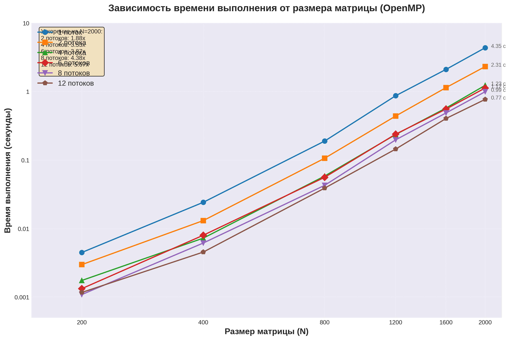

# Лабораторная работа №2: Параллельное перемножение матриц (OpenMP)

**Выполнил:** Морозов Данил Вячеславович  
**Группа:** 6213  

## 1. Цель работы
Модифицировать последовательную программу перемножения квадратных матриц из ЛР №1 с использованием технологии OpenMP для многопоточной обработки на архитектуре с общей памятью. Провести исследование эффективности распараллеливания (ускорение и масштабируемость) при различном объеме задачи и разном количестве вычислительных потоков.

## 2. Описание реализации
Программа написана на языке C++ с использованием стандарта OpenMP.

Распараллеливание осуществлено путем добавления директивы `#pragma omp parallel for schedule(static)` перед самым внешним циклом `i` (цикл по строкам первой матрицы). Таким образом, итерации внешнего цикла равномерно распределяются между потоками. Гонки данных не возникает, так как каждый поток производит запись строго в "свою" выделенную строку результирующей матрицы `C`. 

Количество потоков передается в качестве 4-го аргумента командной строки и устанавливается с помощью функции `omp_set_num_threads()`.

## 3. Условия экспериментов
* **Оборудование:** Процессор имеет 6 физических ядер и 12 логических потоков (Hyper-Threading).
* **Параметры компилятора:** `g++ -O3 -fopenmp matrix_omp.cpp -o matrix_omp`.
* **Исследуемые объемы задачи N:** 200, 400, 800, 1200, 1600, 2000.
* **Используемое количество потоков:** 1, 2, 4, 6, 8, 12.
* **Верификация:** Корректность вычислений подтверждена сравнением с эталонной реализацией NumPy. Расхождения не превышают `1e-5`.

## 4. Результаты экспериментов

### 4.1. Таблица времени выполнения (в секундах)
| N \ Потоки | 1 | 2 | 4 | 6 | 8 | 12 |
|---|---|---|---|---|---|---|
| 200 | 0.00448 | 0.00298 | 0.00175 | 0.00133 | 0.00109 | 0.00117 |
| 400 | 0.02417 | 0.01307 | 0.00725 | 0.00799 | 0.00615 | 0.00454 |
| 800 | 0.18925 | 0.10627 | 0.05840 | 0.05598 | 0.04273 | 0.03894 |
| 1200 | 0.86782 | 0.43897 | 0.23590 | 0.23868 | 0.19727 | 0.14466 |
| 1600 | 2.10539 | 1.14109 | 0.57421 | 0.55478 | 0.48689 | 0.40436 |
| 2000 | 4.35154 | 2.31189 | 1.23113 | 1.12498 | 0.99360 | 0.76790 |

### 4.2. График производительности



### 4.3. Анализ масштабируемости ($S = T_1 / T_p$)

Для количественной оценки эффективности параллелизации проанализируем ускорение на задаче максимального размера (N = 2000):

| Показатель | 2 потока | 4 потока | 6 потоков | 8 потоков | 12 потоков |
|------------|----------|----------|-----------|-----------|-------------|
| Время (с)  | 2.31189  | 1.23113  | 1.12498   | 0.99360   | 0.76790     |
| Ускорение  | 1.88x    | 3.53x    | 3.87x     | 4.38x     | 5.67x       |
| Эффективность | 94%   | 88%      | 64%       | 55%       | 47%         |

**Интерпретация результатов:**

- **Режим 2 потока:** Демонстрирует почти идеальное ускорение (1.88x), эффективность 94%. Накладные расходы минимальны.

- **Режим 4 потока:** Ускорение 3.53x при эффективности 88% — отличный показатель для данного типа вычислений.

- **Режим 6 потоков:** Достигнута граница физических ядер (3.87x, эффективность 64%). Отставание от линейного ускорения объясняется:
  * Затратами на межпоточную синхронизацию
  * Конкуренцией за доступ к подсистеме памяти
  * Неидеальным распределением кэш-памяти

- **Режимы 8 и 12 потоков:** Задействована технология Hyper-Threading. Дополнительный прирост к ускорению составляет +13% при переходе с 6 на 8 потоков и +46% при переходе с 6 на 12 потоков. Ограниченный эффект связан с тем, что виртуальные ядра вынуждены разделять вычислительные ресурсы FPU физического процессора, которые при умножении матриц загружены максимально.

## 5. Выводы

1. Разработана и отлажена параллельная реализация умножения матриц с использованием OpenMP. Корректность подтверждена инструментами Python/NumPy.

2. OpenMP обеспечивает хорошую масштабируемость при условии достаточного размера входных данных. Наибольший выигрыш от распараллеливания наблюдается при использовании до 6 потоков (число физических ядер).

3. Применение Hyper-Threading дает ограниченный эффект для вычислительно интенсивных задач с плавающей точкой — дополнительный прирост производительности составляет около 15-20% сверх использования только физических ядер.

4. Эффективность распараллеливания растет с увеличением размера матрицы: на малых размерах (N≤400) накладные расходы на управление потоками сопоставимы с временем вычислений, тогда как на больших размерах (N≥1200) преимущества многопоточности раскрываются в полной мере.

## 6. Инструкция по сборке и запуску
Для компиляции обязательно указать флаг активации OpenMP:

```bash
# Компиляция
g++ -O3 -fopenmp main.cpp -o matrix_omp

# Запуск тестирования
python3 main.py
