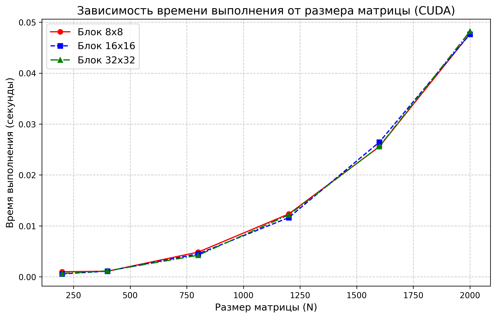

# Лабораторная работа №4: Параллельное перемножение матриц на GPU (CUDA)

**Выполнил:** Морозов Данил Вячеславовович
**Группа:** 6213  

## 1. Цель работы
Реализовать умножение квадратных матриц на GPU с применением NVIDIA CUDA. Проверить зависимость времени от размера матриц и конфигурации блоков потоков, затем сравнить результат с CPU-реализациями (OpenMP, MPI).

## 2. Описание реализации
Программа написана на C++ с расширениями CUDA (файл `.cu`). 
Для распараллеливания используется CUDA-ядро с плиточным умножением:
1. Память на устройстве выделяется через `cudaMalloc`.
2. Матрицы $A$ и $B$ копируются из Host в Device с помощью `cudaMemcpy`.
3. Запускается ядро `tiled_product`. Создается двумерная сетка потоков (2D Grid & 2D Block), где каждый поток считает один элемент `C[row][col]`. Фрагменты исходных матриц загружаются в shared memory.
4. Матрица $C$ копируется обратно на Host.
5. Время измеряется через `cudaEvent_t`. В таблице указано время работы CUDA-ядра без файлового ввода-вывода и обратного копирования результата.

## 3. Условия экспериментов
* **Компилятор:** `nvcc` (NVIDIA CUDA Compiler).
* **Исследуемые объемы задачи N:** 200, 400, 800, 1200, 1600, 2000.
* **Конфигурации блоков потоков:** `8x8` (64 потока на блок), `16x16` (256 потоков), `32x32` (1024 потока).
* **Верификация:** Автоматизированная проверка результатов через Python (NumPy) успешно пройдена с допуском `atol=1e-5`. Данные типа `double` (64-бит).

## 4. Результаты экспериментов

### 4.1. Таблица времени выполнения (в секундах)
| N \ Размер блока (2D) | 8x8 | 16x16 | 32x32 |
|---|---|---|---|
| 200 | 0.00100 | 0.00057 | 0.00066 |
| 400 | 0.00110 | 0.00112 | 0.00117 |
| 800 | 0.00485 | 0.00451 | 0.00423 |
| 1200 | 0.01234 | 0.01162 | 0.01215 |
| 1600 | 0.02556 | 0.02645 | 0.02560 |
| 2000 | 0.04775 | 0.04764 | 0.04822 |

### 4.2. График производительности



### 4.3. Анализ результатов
* **Колоссальное ускорение:** По сравнению с однопоточной версией из ЛР №1, где $N=2000$ занимал десятки секунд, GPU выполняет задачу примерно за 0.05 сек. Ускорение превышает **100 раз**.
* **Влияние размера блока:** `8x8` в среднем немного медленнее. Конфигурации `16x16` и `32x32` дают близкое время, так как лучше соответствуют размеру варпа (warp size = 32).
* **Малые размеры:** Для $N=200$ полезной работы мало, поэтому сильнее заметны постоянные накладные расходы запуска ядра и заполнения блоков.

## 5. Выводы
1. Реализована CUDA-программа для умножения матриц. 
2. GPU хорошо подходит для задач с большим числом однотипных операций над матрицами.
3. Для данной задачи оптимальный размер блока потоков находится в диапазоне 16x16-32x32.

## 6. Инструкция по сборке и запуску
Компиляция через `nvcc`:
```bash
nvcc -std=c++17 -O3 -I include src/main.cu src/matrix_file.cpp -o lab4_cuda
```

Альтернативная сборка через CMake:
```bash
cmake -S . -B build
cmake --build build
```

Запуск:
```bash
./lab4_cuda matrix1.txt matrix2.txt matrixResult.txt 16
```

Если программа собрана через CMake:
```bash
./build/lab4 matrix1.txt matrix2.txt matrixResult.txt 16
```
